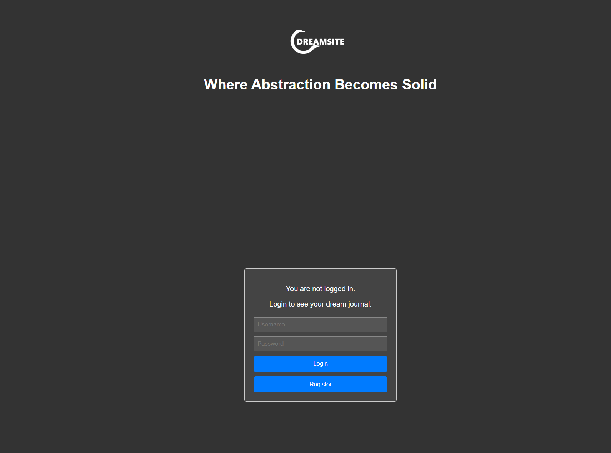
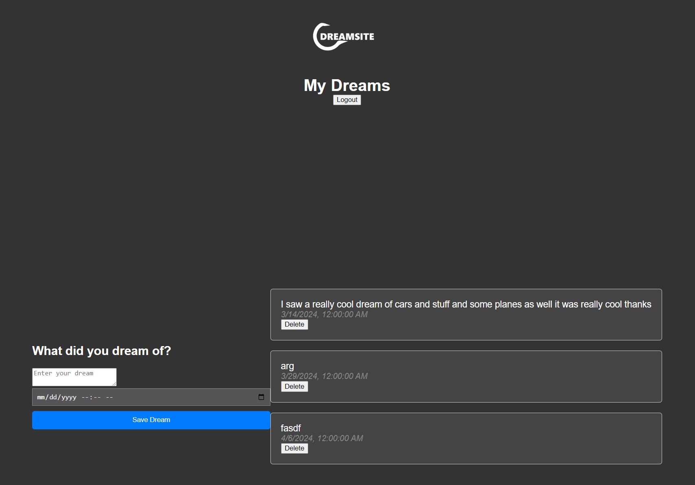

# Dreamsite Setup & api

**Node.js + Express** application.

## Functions of Dreamsite

1. **User Registration:**
   - Users can register for an account by providing a unique username and a password.
   - Empty fields are not allowed during registration.

2. **Login:**
   - Registered users can log in to the application by providing their username and password.
   - Empty fields are not allowed during login.

3. **Token-based Authentication:**
   - Upon successful login, the server issues a JSON Web Token (JWT) to the client.
   - The JWT is used to authenticate subsequent requests to protected endpoints.

4. **Fetching User Dreams:**
   - Authenticated users can fetch their dreams from the server.
   - Each dream entry includes the text of the dream and the date it was recorded.

5. **Saving Dreams:**
   - Authenticated users can save new dreams to the server.
   - Users provide the text of the dream and the date it was recorded.
   - Empty dream text or date fields are not allowed when saving a dream.

6. **Deleting Dreams:**
   - Authenticated users can delete their dreams from the server.
   - Each dream entry displayed on the client-side has a delete button associated with it.
   - Clicking the delete button sends a request to the server to delete the corresponding dream entry.

7. **Logout:**
   - Users can log out of the application, terminating their current session and removing the authentication token.

These functions collectively allow users to register, log in, save dreams, view saved dreams, delete dreams, and log out of the application.

## Usage

1. Clone/download code
2. Install & start MySQL/MariaDB server
3. Run the contents of "sqlbase.sql" to create the database
4. Edit the "db.js" file to match your usage
5. Run the "server.js" file
6. Run the "login.html" file

## Screenshots




## Resources and endpoints

### `/auth/register` 

```http
#register user
POST http://127.0.0.1:3000/auth/register
content-type: application/json
{
  "username": "user",
  "password": "secret"
}
```

### `/auth/login` 

Example queries:

```http
# Login
POST http://127.0.0.1:3000/auth/login
content-type: application/json
{
  "username": "user",
  "password": "secret"
}
```

### `/dreams/create`

Example queries:

```http
# Create a dream for a logged in user
POST http://127.0.0.1:3000/dreams/create
Authorization: Bearer <token>

content-type: application/json
{
  "dream_text": "I dreamt of sheep",
  "dream_date": date
}
```

### `/dreams/get`

Example queries:

```http
# Get all dreams a logged in user
GET http://127.0.0.1:3000/dreams/get
Authorization: Bearer <token>
```

### `/dreams/delete`

Example queries:

```http
# Delete logged dream of a logged in user by dream id
POST http://127.0.0.1:3000/dreams/delete
content-type: application/json
body: {"dreamId": id}
```
